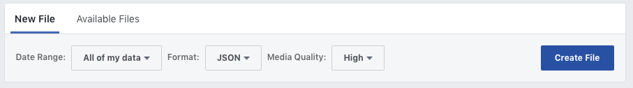

# Facebook data forensics

Given
[all of](https://www.theguardian.com/news/2018/mar/17/cambridge-analytica-facebook-influence-us-election)
the
[recent](https://www.bbc.com/news/technology-46231284)
issues
[around Facebook](https://www.bbc.com/news/technology-43649018)
and the data it keeps about
[all of us](https://www.consumerreports.org/digital-security/what-makes-the-facebook-data-breach-so-harmful/)
it seemed like a good time for a tool to help us analyze the data dump Facebook is
[willing to give us](https://www.facebook.com/help/1701730696756992?helpref=hc_global_nav).

## Feature Status

Working:

* show counts of various database records that Facebook keeps about you
* show how many messages you've sent with each of your Facebook Messenger correspondants
* search for keywrods in your [Facebook Messenger](https://www.facebook.com/messenger/) history

More features are [planned](TODO.md).

## Installation

There are very few dependancies to make this code work.

* Perl 5.x - nothing special or new needed
* [`JSON::MaybeXS`](https://metacpan.org/pod/JSON::MaybeXS) module and one of the three JSON modules it supports.

To get this on CentOS 7 I would run:

	yum install perl-JSON-MaybeXS perl-JSON-XS

In Debian or Ubuntu this should work:

	apt-get install libjson-maybexs-perl libjson-xs-perl

Once you've got that pre-requisite out of the way somehow you need to clone this repo:

	git clone https://github.com/chicks-net/fbdata-forensics.git
	cd fbdata-forensics

## Using

### Get your data

Get your data [from Facebook](https://www.facebook.com/help/1701730696756992?helpref=hc_global_nav).
Ask for it as JSON since this tool doesn't process the HTML flavor of the data download.
I've seen reports of the data taking 2-4 hours to be ready, but for me it took 28 hours.

Facebook gives you a file like `facebook-username.zip`.
I would rename it to `facebook-username-YYYMMDD.zip`.  So for me it ends up being `facebook-chicks-20181118.zip`.

### Unpack your data

Within a copy of this repo create a directory like `data.username`.  For me
`data.chicks` would be created by

	mkdir data.chicks

NOTE: Any `data.*` directory will be hard to add to git because it is intentionally in the
[`.gitignore`](.gitignore).

Then unpack your data into that directory:

	cd data.chicks
	unzip ~/Downloads/facebook-chicks-20181118
	# zip, zip, zip
	cd ..
	# you should be back in the top dir of this repo

### Data overview

To get a high-level overview run `./json-counts` with a directory of Facebook data prepared
as mentioned in the previous section.  For example:

	fbdata-forensics$ ./json-counts data.chicks
	data.chicks looks like a Facebook data dump
	- 0 marketplace entries
	- 0 saved_items entries
	... skipping about_you/face_recognition.json which isn't generic enough for here
	... skipping about_you/friend_peer_group.json which isn't generic enough for here
	... skipping about_you/your_address_books.json which isn't generic enough for here
	- 0 ad interests entries
	- 0 advertiser uploaded contact entries
	- 4 advertiser touched entries
	- 6 installed_apps entries
	- 361 app_post entries
	- 79 comment entries

### Search messages

Edit the [`keywords.txt`](keywords.txt) file to contain the words to dig for in your messages.
Then run `./json-messages` with a directory of Facebook data like so:

	fbdata-forensics$ ./json-messages data.chicks/
	data.chicks/ looks like a Facebook data dump
	- 107 conversations found in Facebook Messages
	+ 1 messages with Abe Jones (inbox)
	$keyword_matches = {};
	+ 1 messages with Alex Smith (inbox)
	$keyword_matches = {};
	+ 6 messages with Bob Smith (inbox)
	$keyword_matches = {};
	+ 1 messages with Carol Jones (inbox)
	$keyword_matches = {};

## Support

Please file [github issues](https://github.com/chicks-net/fbdata-forensics/issues)
for things not [already planned](TODO.md).

## Author

[Christopher Hicks](http://www.chicks.net)
is the primary author of this project.  He has gotten
lots of assistance and wonderful feedback so noone
is pretending they are doing it all alone.
